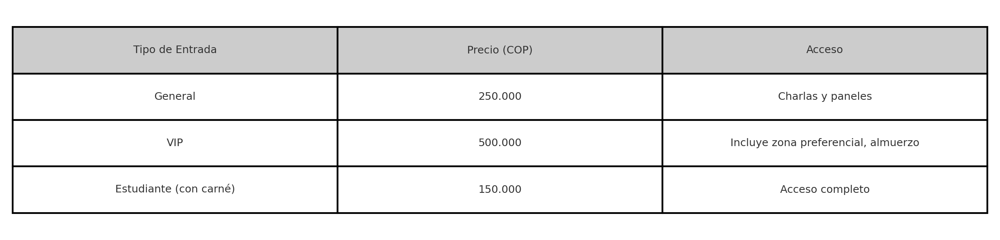
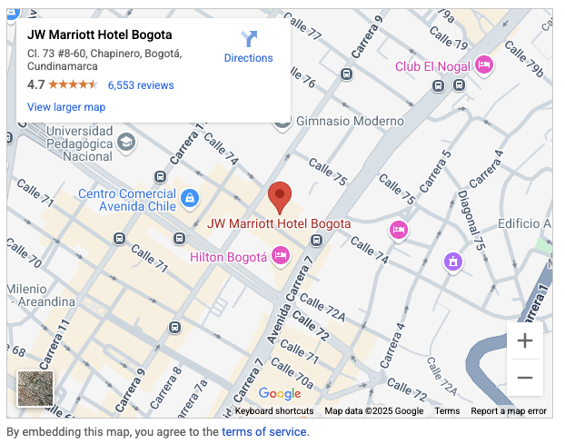

# IENSCH - Taller final de HTML
---

# 🧠 Desafío de Desarrollo Web: 
## Página para Foro Internacional de Inteligencia Artificial

---

## 📘 Contexto

La empresa **NeuroFuture S.A.S.**, dedicada al desarrollo de soluciones basadas 
en inteligencia artificial, está organizando el **Foro Internacional de Inteligencia
Artificial (FIIA 2025)**. Este evento se llevará a cabo en el prestigioso hotel 
**JW Marriott Bogotá**, en la ciudad de Bogotá, Colombia.

El equipo de marketing ha solicitado al equipo de desarrollo web la creación de 
una página web informativa y funcional que promueva el evento e incentive la 
inscripción de los asistentes.

---

## 🧾 Requisitos del Proyecto

La página debe estar construida únicamente con HTML y debe incluir los siguientes 
elementos:

- Un **encabezado principal** que contenga el título del evento y un subtítulo motivacional.
- Un **párrafo introductorio** que describa el foro y su importancia.
- Una **lista no ordenada** con las temáticas principales del evento, como:
  - Inteligencia artificial en la salud
  - Ciudades inteligentes
  - Ética en la IA
  - Aprendizaje automático y profundo
- Una **tabla** con el precio de la entrada y sus beneficios.
- un **formulario** de inscripción al evento.
- Un **iframe de Google Maps** embebido que muestre la ubicación del hotel donde se realizará el evento.
- Uso adecuado de **elementos básicos de texto**, como `strong`, `em`, `blockquote`, entre otros, para enriquecer el contenido visual y semántico.

---

## 🏷️ Tabla de precios
> A continuación, se presenta la tabla con los tipos de entradas, precio y beneficios
que los estudiantes deben replicar:

---

## 📋 Referencia del Formulario de Inscripción

El siguiente formulario tiene como finalidad recopilar la información necesaria 
de los asistentes interesados en participar en el **Foro Internacional de Inteligencia
Artificial (FIIA 2025)**, organizado por **NeuroFuture S.A.S.** en el hotel JW Marriott, Bogotá.

> Se debe implementar este formulario utilizando **HTML semántico** y diversos 
tipos de input de formulario. **Todos los campos son obligatorios.**

### 📝 Campos Requeridos

- Nombre completo.
- Teléfono
- Fecha de nacimiento
- Correo electrónico
- Tipo de entrada
  - General
  - VIP
  - Estudiante
- Nacionalidad

---

## 🗺️ Ubicación del evento

> Se debe implementar la ubicación del hotel donde se realizará el evento
a través de los mapas embebidos de Google Maps. Así tal cual como en la siguiente
referencia:

---

## 📌 Objetivo

El objetivo del reto es que los estudiantes pongan en práctica sus conocimientos 
de HTML para resolver un problema real mediante una solución tecnológica, 
desarrollando habilidades en la estructuración de contenido web, el uso de 
elementos semánticos y la integración de recursos multimedia. Con este ejercicio
se busca fortalecer su capacidad para aplicar conceptos aprendidos en contextos 
profesionales.

---

## 🧪 ¿Qué aprenderán los estudiantes?

- Cómo estructurar un documento HTML utilizando **etiquetas semánticas** para organizar correctamente la información de un evento.
- Cómo dividir el contenido en **secciones lógicas** usando etiquetas como `<section>`, `<header>`, `<main>` y `<footer>`.
- Cómo implementar **formularios completos** con distintos tipos de input (`text`, `email`, `date`, `select`, `email`, entre otros.).
- Cómo construir e interpretar **tablas HTML** para representar información como tarifas o categorías.
- Cómo integrar contenido externo utilizando la etiqueta `<iframe>`, por ejemplo, un **mapa de Google** con la ubicación del evento.

---

## 🧪 Habilidades que se reforzarán

- **Diseñar formularios web** realistas para recolección de datos en eventos o sistemas de registro.
- Aplicar correctamente la **semántica HTML** para mejorar la accesibilidad y estructura del sitio.
- Reforzar la **jerarquía y organización del contenido** en una página web profesional.
- **Integrar recursos externos** (como mapas o videos) usando elementos como `<iframe>`.
- Comprender cómo presentar datos estructurados en formato **tabular** mediante etiquetas como `<table>`, `<thead>`, `<tbody>` y `<tr>`.

---

## 🧠 ¿Ideas para extender el proyecto?

- Agregar una sección de **ponentes internacionales** con sus perfiles y áreas de especialización usando tarjetas HTML (`<article>`).
- Implementar una **confirmación visual** del formulario (mensaje de agradecimiento o redirección después del envío).
- Incluir una **galería de imágenes** del hotel o ediciones anteriores del foro usando `<figure>` y ``.
- Añadir una **barra de navegación interna** que permita ir rápidamente a secciones como "Formulario", "Ubicación", "Precios", etc.
- Crear una versión básica de la página con **estilos CSS simples** para mejorar la presentación visual sin depender de frameworks externos.

---

## Licencia

Distribuido bajo la licencia MIT. Consulta la sección «LICENCIA» para más información.